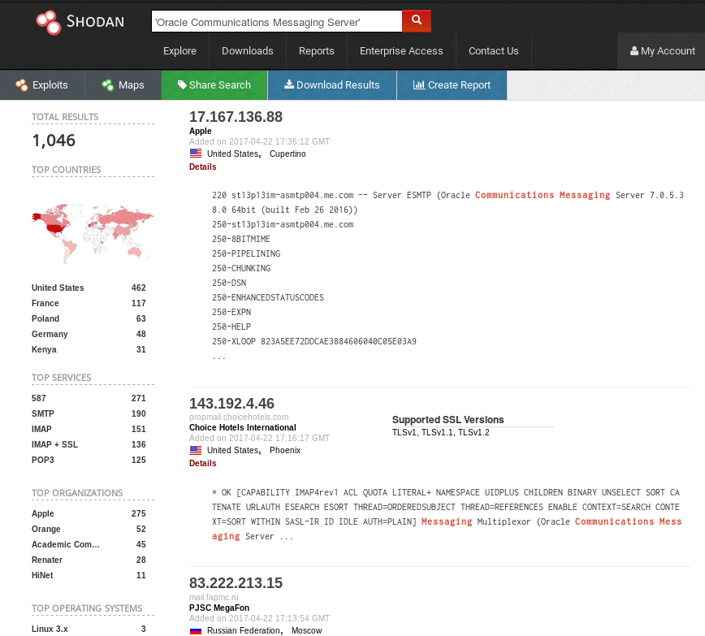

# Shadow Brokers / Equation Group analysis

## Overview

The Shadow Brokers Equation Group dump consists of a number of partial dumps.

I am currently looking at the list of compromised hosts (Intonation/Pitchimpair), which includes
getting very distracted with all the really cool tricks of the trade included in the files.
I'm working from **x0rz** repositories (https://github.com/x0rz/) as well as the initial release on Mega.
Just to start somewhere, I was using alist online which describes some of the implants and what they supposedly do.
As I dive deeper (and as others also spend way too much time spelunking) I hope we get more clarity on this.

|Tool name      |functionality           |
| ------------- | ---------------------- |
|DEWDROP        |Command and Control     |
|INCISION       |Rootkit/Backdoor linux  |
|INTONATION     |?                       |
|JACKLADDER     |?                       |
|ORANGUTAN      |?                       |
|PATCHICILLIN   |?                       |
|RETICULUM      |?                        |
|SIDETRACK      |implant for PITCHIMPAIR 1)|
|STOICSURGEON   |Rootkit/Backdoor        |

## Intonation Onesies


The initial Shadow Brokers dump was called `trickortreat`. It contains two directories
`pitchimpair` and `intonation`. These in turn contain directories in the format `<hostname>__<ipaddress>`.
In each directory is/are file(s) containing parameters to be fed into different tools.
When I figure out exactly what is happening, I'll go into that further.
For instance, the `incision` example below seems to have been fed into `tn` to set up an INCISION
shell called `ish`.

*incision*:

```bash
INTONATION___bgl1dr1-a-fixed.sancharnet.in___61.1.128.17___20040323-141833() {
    ## INCISION Version:4.9.1 OS:sparc-sun-solaris2.8
    export TARG_AYT="36eb9564 129b94c7 695de5dc"
}
```

Both `intonation` and `pitchimpair` include a number of targets which have only one
implant. Being Dutch, opcwdns.opcw.nl (`195.193.177.150`) caught my eye.
OPCW is the **Organisation for the Prohibition of Chemical Weapons**.
That would seem like a prime target for the NSA to have backdoor access to.
Which started me wondering: why only one (JACKLADDER) implant?

It is generally thought that the tools Shadow Brokers initially released, were meant for
what can be crudely described as "plumbing": a group gaining footholds in networks
which could be used (by others, or from different systems than the Shadow Brokers had
access to) to stage subsequent attacks.

This is my thesis: If access was (accidentally) gained to a high-value target, no further
"plumbing" was done and the access was leveraged for other activities (by others/from elsewhere?).
For this to be true, we would need to see a distinct difference between the "onesies" and
this systems with multiple implants.

To start, I looked at all the "*onesies*" in the `intonation` list, combining historical and current data
to determine what type of organizations where behind the hosts/IP addresses. For my theory to pan out,
these "*onesies*" would have to be prime targets.

Each host with multiple implants would also have to be a lesser-value target for my thesis to hold up.
I will be looking into the `intonation` list first, working from *onesies* to the multiple ones.

Rather large amounts of work still need to be done, but I'll share my findings as I go. Lets see where it
gets me.

Starting with the list of "onesies" as part of the `intonation` "pitch":

|ip address     |hostname               |implant type|YYYYMMDD-HHMMSS|
|:--------------|:----------------------|:-----------|:--------------|
|203.135.2.194|tx.micro.net.pk|jackladder|20000817-131726|
|210.232.42.3|hakuba.janis.or.jp|jackladder|20000822-135045|
|210.157.0.87|mail.interq.or.jp|jackladder|20000824-112840|
|210.235.164.21|mx1.freemail.ne.jp|jackladder|20000828-113641|
|166.114.10.28|webnetra.entelnet.bo|jackladder|20000830-141831|
|195.193.177.150|opcwdns.opcw.nl|jackladder|20000906-160642|
|206.49.164.2|rayo.pereira.multi.net.co|jackladder|20000920-080519|
|148.233.6.164|sedesol.sedesol.gob.mx|jackladder|20000921-123525|
|195.222.48.5|most.cob.net.ba|jackladder|20000921-123455|
|202.96.135.140|ns.huawei.com.cn|jackladder|20000921-123547|
|193.188.71.4|petra.nic.gov.jo|jackladder|20000927-064730|
|206.48.31.2|eol1.egyptonline.com|jackladder|20001018-150945|
|202.96.203.173|mailgate.sbell.com.cn|jackladder|20001107-133342|
|203.236.114.1|sky.kies.co.kr|jackladder|20010213-092903|
|216.72.24.114|mn.mn.co.cu|jackladder|20010227-160012|
|200.38.166.2|segob.gob.mx|jackladder|20010712-142300|
|168.160.71.3|fw433.npic.ac.cn|jackladder|20010822-105425|
|195.68.99.20|www.caramail.com|jackladder|20010915-191446|
|202.204.193.1|dmn2.bjpeu.edu.cn|jackladder|20010929-205746|
|194.243.154.62|gambero3.cs.tin.it|reticulum|20011101-224414|
|210.83.3.26|ns.nint.ac.cn|orangutan|20020506-121324|
|193.233.3.6|mail.ioc.ac.ru|jackladder|20021212-171056|
|213.140.195.7|dns2.net1.it|incision|20030327-165934|
|210.155.61.54|mail-gw.jbic.go.jp|reticulum|20030423-123428|
|202.125.138.184|opserver01.iti.net.pk|orangutan|20030522-152610|
|202.112.5.66|sea.net.edu.cn|patchicillin|20031023-175029|
|61.0.0.46|nd11mx1-a-fixed.sancharnet.in|orangutan|20031204-134957|
|61.0.0.46|ndl1mc1-a-fixed.sancharnet.in|incision|20031204-134957|
|202.107.197.199|mail.hangzhouit.gov.cn|incision|20050124-103318|
|203.199.143.2|mail.tropmet.res.in|incision|20061205-165032|
|202.121.224.5|smmu-ipv6.smmu.edu.cn|incision|20070126-160444|
|62.76.114.22|jur.unn.ac.ru|dewdrop|20070205-150930|
|62.76.114.22|jur.unn.ac.ru|stoicsurgeon|20070205-150930|
|144.206.175.2|unk.vver.kiae.rr|jackladder|20070412-144249|
|194.226.57.53|kserv.krldysh.ru|jackladder|20070417-154636|
|80.191.2.2|laleh.itrc.ac.ir|incision|20030411-160713|

Working with hostnames/ IP addresses/ whois data/ (scholar.)google.com and archive.org was tricky, 
because most of the tools of the trade try to be current, not historical. In the end my endeavors resulted in the following list.
If you have more or better information, please feel free to contact me.

|hostname|country|vertical(s)|implant type|context                                      |
|:-------|:------|:----------|:-----------|---------------------------------------------|
|dmn2.bjpeu.edu.cn|CN|OIL|jackladder|China University of Petroleum-Beijing|
|tx.micro.net.pk|PK|TELCO/ISP|jackladder|Now part of Nayatel, A Premium Triple Play (Internet, Cable TV, Phone) Service provider|
|hakuba.janis.or.jp|JP|TELCO/ISP|jackladder|A phone/webmail/adsl/isdn etc. provider in Japan.|
|mail.interq.or.jp|JP|TELCO/ISP|jackladder|Japanese ADSL, ISDN, optical provider|
|mx1.freemail.ne.jp|JP|TELCO/ISP|jackladder|SOFTBANK TELECOM Corp/Japan Telecom: long-distance/international/direct connection telephone service.|
|webnetra.entelnet.bo|BO|GOV/IT|jackladder|The Agency for the Development of the Information Society in Bolivia (ADSIB)|
|opcwdns.opcw.nl|NL/INT|MIL/GOV|jackladder|The Organisation for the Prohibition of Chemical Weapons (OPCW, opcwdns.opcw.org)|
|rayo.pereira.multi.net.co|CO|GOV|jackladder|? Not sure, seeing this domain in old (consulate) email addresses, semi gov/university|
|most.cob.net.ba|BA|TELCO|jackladder|Bosnia And Herzegovina Sarajevo Bh Telecom D.d. Sarajevo|
|sedesol.sedesol.gob.mx|MX|GOV|jackladder|The Secretariat of Social Development (Secretaría de Desarrollo Social; SEDESOL)|
|ns.huawei.com.cn|CN|TELCO/ISP|jackladder|Chinese multinational networking and telecommunications equipment and services company|
|petra.nic.gov.jo|JO|GOV|jackladder|Name server of the Center of Excellence for development and implementation of government IT strategies|
|eol1.egyptonline.com|EG|TELCO/ISP|jackladder|Old. Probably Egypt Online/EOL.com. Information available to me is sketchy.|
|mailgate.sbell.com.cn|CN|TELCO/ISP|jackladder|State owned enterprise (SASAC). Alcatel-Lucent Shanghai Bell end-to-end telecommunications solutions, wireless and wireline, optical access, LTE, optics, IP, core network, network management and services.
|sky.kies.co.kr|KR|IT|jackladder|? Seems to be a rather small IT solutions company in Korea, now a part of/selling HP. Special interest?|
|mn.mn.co.cu|CU|GOV|jackladder|https://books.google.nl/books?isbn=3540322426 pointing to Central Criminologist Laboratory of Cuba|
|segob.gob.mx|MX|GOV|jackladder|Secretary of the Government of Mexico|
|fw433.npic.ac.cn|CN|ATOMIC|jackladder|Nuclear Power Institute of China (NPIC), a subsidiary to China National Nuclear Corporation (CNNC), only large-scale comprehensive R&D base in China|
|www.caramail.com|FR|TELCO/ISP|jackladder|Caramail S.A. operates as a webmail service company offering instant messaging services.|
|gambero3.cs.tin.it|IT|TELCO/ISP|reticulum|Telecom Italia Net (NET NOC)|
|ns.nint.ac.cn|CN|ATOMIC|orangutan|Northwest Institute of Nuclear Technology, Xi'an, China|
|mail.ioc.ac.ru|RU|GOV/MIL/PETROL|jackladder|research in mathematical chemistry and computer synthesis. ZIOC focuses on basic research activities with practical solutions of top priority for Russia. [...] After the war, the main research was aimed at the build-up of USSR defense capacity.|
|dns2.net1.it|IT/INT|FINANCE|incision|Probably sub dns of NET1.com. Leading transacting system for billions of unbanked and under-banked people in the world to engage in electronic transactions"|
|mail-gw.jbic.go.jp|JP|FINANCE|reticulum|Japanse bank for International Cooperation|
|opserver01.iti.net.pk|PK|IT/TELCO|orangutan|ITILahore, NET.PK ISP in Pakistan|
|sea.net.edu.cn|CN|EDU|patchicillin|? "non-onesie"?. Actually has 4 implants. A website to VPN into a Chinese educational enviroment|
|nd11mx1-a-fixed.sancharnet.in|IN|TELCO|orangutan|? "non-onesie"? nd11* seems to be a typo. I can find the ndl* host in old (email) posts on the internet, nd11 only in EQGRP files|
|ndl1mc1-a-fixed.sancharnet.in|IN|TELCO/ISP|incision|? The above makes this a probable False Positive, at least as far as *onesies* go. It is, however, an interesting target: BSNL is India's no. 1 Internet service provider with more than 17 lakh (100.000) subscribers, providing Internet service throughout the entire country (except in New Delhi and Mumbai) under the brand name of " Sancharnet"|
|mail.hangzhouit.gov.cn|CN|GOV/IT|incision|Seems to be a mail server used by at least some people at College of Computer Science, Zhejiang University, HangZhou. Currently gone.|
|mail.tropmet.res.in|IN|GOV|incision|The Indian Institute of Tropical Meteorology (IITM), Pune, fully devoted to cutting edge research [...] The Institute has excellent infrastructural facilities such as High Performance Computers, observational facilities like RADARS, Radiometers, LIDAR etc., It has a strong link with various universities and national and international organizations. Major research areas at the institute are [...] satellite and radar[...]|
|smmu-ipv6.smmu.edu.cn|CN|MIL|incision|Second Military Medical University|
|jur.unn.ac.ru|RU|GOV|stoicsurgeon|? "non-onesie"? European and international law of UNN. I found some articles on scholar.google.com referring to European law, Europe etc. Rather tangent. It seems to be two different OS’es but actually two attacks so might not be relevant. Also, DEWDROP might be C2|
|jur.unn.ac.ru|RU|GOV|dewdrop|? "non-onesie"? Might be two different OSes on different ports, both owned?|
|unk.vver.kiae.rr|RU|ATOMIC|jackladder|Russian Research Centre "Kurchatov Institute" (Kurchatov Institute of Atomic Energy)|
|kserv.krldysh.ru|RU|GOV|jackladder|Keldysh Institute of Applied Mathematics (Russian Academy of Sciences) was founded in 1953 to solve complex mathematical problems involved in national projects of space exploration, atomic and thermonuclear energy application, etc.|
|laleh.itrc.ac.ir|IR|GOV|incision|? "non-onesie" Very interesting target, but multi-powned? ICT Research Institute or IRAN Telecommunication Research Center (ITRC) is the Iranian most experienced research entity in the Information and Communication Technology|

The most interesting part is that, except for the (for me) unclear one in Korea, all of them point to targets which I could reason are high-value to the NSA.
But `laleh.itrc.ac.ir` is actually running multiple implants (it seemed a onesie because of the trailing dot in a directory name). So that makes the theory somewhat shaky.

Lets start by working down from the systems with most implants. Although there are a number of targets with 7 (and one target, apparently incorrect 8) implants, they are all in `pitchimpair`. 

### Intonation targets with six(6) implants

|ip address     |hostname               |implant type|YYYYMMDD-HHMMSS|
|:--------------|:----------------------|:-----------|:--------------|
|202.112.176.3|indy.fjmu.edu.cn| sidetrack patchicillin orangutan jackladder incision dewdrop|20060509-093858|
|194.84.23.125|ns2.rosprint.ru|sidetrack patchicillin orangutan jackladder incision dewdrop|20060322-144346|
|61.0.0.46|ndl1mx1-a-fixed.sancharnet.in|sidetrack patchicillin orangutan jackladder incision dewdrop|20060606-162122|

#### Initial observations:

 1. They all have the same implants
 2. All files have the same INTONATION function(?) with the same timestamp for all implants per target
 3. All of them are from 2006

|hostname|country|vertical(s)|implant type|context                                      |
|:-------|:------|:----------|:-----------|---------------------------------------------|
|indy.fjmu.edu.cn|CN|UNI|sidetrack patchicillin orangutan jackladder incision dewdrop|Beijing Medical University. Cannot easily establish relevance|
|ns2.rosprint.ru|RU|TELCO|sidetrack patchicillin orangutan jackladder incision dewdrop|From the archive.org page in 2006: "Equant (rosprint.ru) serves Russian, foreign and transnational companies and banks/state institutions/SME [with] modern, reliable and high-performance telecommunication solution[s]."|
|ndl1mx1-a-fixed.sancharnet.in|IN|TELCO|idetrack patchicillin orangutan jackladder incision dewdrop|Bharat Sanchar Nigam Limited (abbreviated BSNL) is an Indian state-owned telecommunications company. On 15 September 2000 took over telecom services and network management from Central Government Departments of Telecom Services (DTS) and Telecom Operations (DTO) with effect from 1 October 2000.| 

#### ndl1mx1-a-fixed.sancharnet.in

 - https://sourceforge.net/p/jboss/mailman/message/16898038/ and http://mail.mail.sarai.net/pipermail/aaj-ke-naam_mail.sarai.net/2006-April/007106.html show us some software the system was running.
 - Looking at CVE databases only showed some xss and local exploits (https://www.cvedetails.com/vulnerability-list/vendor_id-5/product_id-4721/SUN-Iplanet-Messaging-Server.html) 


For example:

http://mail.mail.sarai.net/pipermail/aaj-ke-naam_mail.sarai.net/2006-April/007106.html

```mail
[Aaj-ke-naam] Delivery Notification: Delivery has failed
Internet Mail Delivery postmaster at sancharnet.in
Thu Apr 27 17:53:06 CEST 2006

[...]

Return-path: <aaj-ke-naam at sarai.net>
Received: from conversion-daemon.bgl1mx1-a-fixed.sancharnet.in by
bgl1mx1-a-fixed.sancharnet.in
(iPlanet Messaging Server 5.2 HotFix 1.21 (built Sep  8 2003))
id <0IYE00FDA1GIWZ at bgl1mx1-a-fixed.sancharnet.in>
[...]
Received: from sarai.net (dd.nic.in [164.100.38.38])
by bgl1mx1-a-fixed.sancharnet.in
(iPlanet Messaging Server 5.2 HotFix 1.21 (built Sep  8 2003))
```

But having no publicly known exploit didn't stop these people. They literally had a working exploit ready for most versions:

```bash
grep -Ril iplanet * 2>/dev/null
[...]
EQGRP/archive_files/esna (2)/iplanet_5_2hf1_21.py
EQGRP/archive_files/esna (2)/iplanet_5_2hf0_8.py
EQGRP/archive_files/esna (2)/iplanet_5_2hf1_02.py
EQGRP/archive_files/esna (2)/sunJava_6_2_4_03.py
EQGRP/archive_files/esna (2)/sunJava_6_2_3_04.py
EQGRP/archive_files/esna/iplanet_5_2.py
EQGRP/archive_files/esna/iplanet_5_2hf1_16.py
EQGRP/archive_files/esna/iplanet_5_2hf1_25.py
EQGRP/archive_files/esna/targets.py
EQGRP/archive_files/esna/iplanet_5_2p1.py
EQGRP/archive_files/esna/SHA1SUMS
EQGRP/archive_files/esna/iplanet.py
EQGRP/archive_files/esna/docs/cleanup_script
EQGRP/archive_files/esna/iplanet_5_2hf1_21.py
```

Starting as it does with "badBytes" the `iplanet.py` script is immediately recognisable as an exploit to anyone who has ever written one.

```python
1 import time
  2 import smtpUtils
  3 import systems
  4 import utils
  5
  6 class iplanet:
  7    badBytes = [0x0, 0xa, 0xd]
  8    nAttempts = 1
  9
 10    def buildBaseBuffer(self, imtaBase):
 11       filler = utils.buildBuffer(self.baseBufLen, self.badBytes)
 12       baseBuf = filler[0x0:]
 13       return baseBuf
 14
 15    def buildBounceBuffer(self):
 16       imtaBase = self.imtaBase
 17       baseBuf = self.buildBaseBuffer(imtaBase)
 18       l7 = (imtaBase + self.l7Imta) + self.l7Offset
 19       fp = imtaBase + self.fp
 20       filler = utils.buildBuffer(0x18, self.badBytes)
 21       bounceBuf = baseBuf \
 22                   + utils.stringifyAddr(l7) \
 23                   + filler \
 24                   + utils.stringifyAddr(fp) \
 25                   + utils.stringifyAddr(self.pc - 8)
 26       return bounceBuf
 27
```

It seems to be using smtp, so it very much seems like they had (or have) a way of gaining access to a ridiculously often used Enterprise Multi-Tier messaging platform... by sending an email.
And it probably paid off nicely for these guys to have this 0-day (https://en.wikipedia.org/wiki/Oracle_Communications_Messaging_Server):

>Oracle Communications Messaging Server is Oracle's messaging (email) server software.
>The software was obtained by Oracle as part of the company's acquisition of Sun in 2010.
>
>Oracle's Messaging Server could potentially be the most widely deployed commercial
>email server on the planet, with claims of 150 million mailboxes deployed worldwide
>(mostly by ISPs, telcos, universities, government, and cable TV broadband providers).
>History of development
>
>Oracle Communications Messaging Server has a long history, drawing technology from
>
>    Sun Internet Mail Server (SIMS)
>    Netscape Messaging Server (NMS)[2]
>    PMDF from Innosoft
>
>In addition to the Messaging Server's three parents, the software has undergone multiple
>brand naming changes:
>
>    iPlanet Messaging Server
>    Sun ONE Messaging Server
>    Sun Java System Messaging Server
>    Oracle Communications Messaging Exchange Server
>    Oracle Communications Messaging Server
>
>The code base has been carried on throughout these minor brand changes 
>**with only feature enhancements and bug fixes.**

**Sic.**

I just shudder when I read that last sentence. I hope the guys at Oracle/that which was Sun are paying attention, because
if I look at the list of typical users, this would have been (is?) a very fruitful 0-day to have:



It will be interesting to find out which other targets might have been compromised this way.
Additionally of note is that I could not find `esna` nor something matching that acronym in any of the implant lists.
This could mean that the initial RCE/0-day of a target is not included in those lists, although "absence of evidence is not evidence of absence".


To be continued ...


## Notes

1) It doesn't seem like sidetrack was not used for pitchimpair:

```bash
⠠⠵ ls -R intonation/ |grep -i sidetrack |wc -l
23
⠠⠵ ls -R pitchimpair/ |grep -i sidetrack |wc -l
37
```


## Appendix A

Counting the implants per directory:

*count.sh*

```bash
find . -type d -print0 | while read -d '' -r dir; do
files=("$dir"/*)
printf "%5d files in directory %s\n" "${#files[@]}" "$dir"
done
```

## targets with one(1) (registered) implant

```bash
for dir in `bash count.sh | sort -n -r | grep '1 files' | awk '{print $5}'`; do echo -n "$dir: " && ls $dir;done

./pitchimpair/www.elim.net___203.239.130.7: orangutan
./pitchimpair/webshared-admin.colt.net___213.41.78.10: incision
./pitchimpair/vsnlradius1.vsnl.net.in___202.54.4.61: stoicsurgeon
./pitchimpair/vsn1radius1.vsn1.net.in___202.54.4.61: stoicsurgeon
./pitchimpair/sunbath.rrze.uni--erlangen.de___131.188.3.200: orangutan
./pitchimpair/ns2.chem.tohoku.ac.jp___130.34.115.132: incision
./pitchimpair/ns2.chem.tohoku.ac.jp___130.134.115.132: orangutan
./pitchimpair/nl37.yourname.nl___82.192.68.37: incision
./pitchimpair/mail.howon.ac.kr___203.146.64.14: dewdrop
./pitchimpair/info.ccs.net.mx___200.36.53.160: jackladder
./pitchimpair/expos.ee.nctu.edu.tw___140.113.212.20: stoicsurgeon v1.2.7.1 sparc-sun-solaris2.9
./pitchimpair/docs.ccs.net.mx___200.36.53.150: jackladder
./pitchimpair/bambero1.cs.tin.it___194.243.154.57: orangutan
./pitchimpair/axil.eureka.lk___202.21.32.1: orangutan
./intonation/www.caramail.com___195.68.99.20: jackladder
./intonation/webnetra.entelnet.bo___166.114.10.28: jackladder
./intonation/unk.vver.kiae.rr___144.206.175.2: jackladder
./intonation/tx.micro.net.pk___203.135.2.194: jackladder
./intonation/smmu-ipv6.smmu.edu.cn___202.121.224.5: incision
./intonation/sky.kies.co.kr___203.236.114.1: jackladder
./intonation/segob.gob.mx___200.38.166.2: jackladder
./intonation/sedesol.sedesol.gob.mx___148.233.6.164: jackladder
./intonation/rayo.pereira.multi.net.co___206.49.164.2: jackladder
./intonation/petra.nic.gov.jo___193.188.71.4: jackladder
./intonation/opserver01.iti.net.pk___202.125.138.184: orangutan
./intonation/opcwdns.opcw.nl___195.193.177.150: jackladder
./intonation/ns.nint.ac.cn___210.83.3.26: orangutan
./intonation/ns.huawei.com.cn___202.96.135.140: jackladder
./intonation/ndl1mc1-a-fixed.sancharnet.in___61.0.0.46: incision
./intonation/nd11mx1-a-fixed.sancharnet.in___61.0.0.46: orangutan
./intonation/mx1.freemail.ne.jp___210.235.164.21: jackladder
./intonation/most.cob.net.ba___195.222.48.5: jackladder
./intonation/mn.mn.co.cu___216.72.24.114: jackladder
./intonation/mail.tropmet.res.in___203.199.143.2: incision
./intonation/mail.pmo.ac.cn___159.226.71.3:
./intonation/mail.ioc.ac.ru___193.233.3.6: orangutan
./intonation/mail.interq.or.jp___210.157.0.87: jackladder
./intonation/mail.hangzhouit.gov.cn___202.107.197.199: incision
./intonation/mail-gw.jbic.go.jp___210.155.61.54: reticulum
./intonation/mailgate.sbell.com.cn___202.96.203.173: jackladder
./intonation/laleh.itrc.ac.ir.___80.191.2.2: incision
./intonation/kserv.krldysh.ru___194.226.57.53: jackladder
./intonation/hakuba.janis.or.jp___210.232.42.3: jackladder
./intonation/gambero3.cs..tin.it___194.243.154.62: reticulum
./intonation/fw433.npic.ac.cn___168.160.71.3: jackladder
./intonation/eol1.egyptonline.com___206.48.31.2: jackladder
./intonation/dns2.net1.it___213.140.195.7: incision
./intonation/dmn2.bjpeu.edu.cn___202.204.193.1: jackladder
```


## targets with eight(8) (registered) implants

```bash
for dir in `bash count.sh | sort -n -r | grep '8 files' | awk '{print $5}'`; do echo -n "$dir: " && ls $dir;done
./pitchimpair/ns.icu.ac.kr___210.107.128.31: stoicsurgeon v1.2.7.2 sparc-sun-solaris2.8  stoicsurgeon  sidetrack  patchicillin  orangutan  jackladder  incision  dewdrop
```

## targets with seven(7) (registered) implants

```bash
./pitchimpair/ns.hufs.ac.kr___203.253.64.1: stoicsurgeon  sidetrack  patchicillin  orangutan  jackladder  incision	dewdrop
./pitchimpair/ns.anseo.dankook.ac.kr___203.237.216.2: stoicsurgeon  sidetrack  patchicillin  orangutan  jackladder  incision	dewdrop
```

## targets with six(6) (registered) implants

```bash
for dir in `bash count.sh | sort -n -r | grep '6 files' | awk '{print $5}'`; do echo -n "$dir: " && ls $dir;done
./pitchimpair/uji.kyoyo-u.ac.jp___133.3.5.33: sidetrack  patchicillin  orangutan  jackladder incision  dewdrop
./pitchimpair/tologorri.grupocorreo.es___194.30.32.109: sidetrack  patchicillin  orangutan  jackladder incision  dewdrop
./pitchimpair/ns.rtn.net.mx___204.153.24.1: stoicsurgeon  sidetrack  patchicillin  orangutan  incision  dewdrop
./pitchimpair/ns1.gx.chinamobile.com___211.138.252.30: sidetrack  patchicillin  orangutan  jackladder incision  dewdrop
./pitchimpair/newin.int.rtbf.be___212.35.107.2: sidetrack  patchicillin  orangutan  jackladder incision  dewdrop
./pitchimpair/ciidet.rtn.net.mx___204.153.24.32: sidetrack  patchicillin  orangutan  jackladder incision  dewdrop
./intonation/ns2.rosprint.ru___194.84.23.125: sidetrack  patchicillin  orangutan  jackladder incision  dewdrop
./intonation/ndl1mx1-a-fixed.sancharnet.in___61.0.0.46: sidetrack  patchicillin  orangutan  jackladder incision  dewdrop
./intonation/indy.fjmu.edu.cn___202.112.176.3: sidetrack  patchicillin  orangutan  jackladder incision  dewdrop
```


